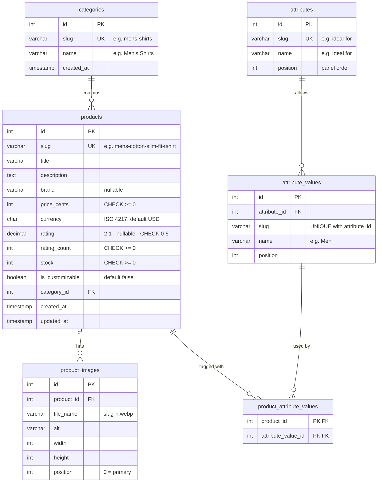
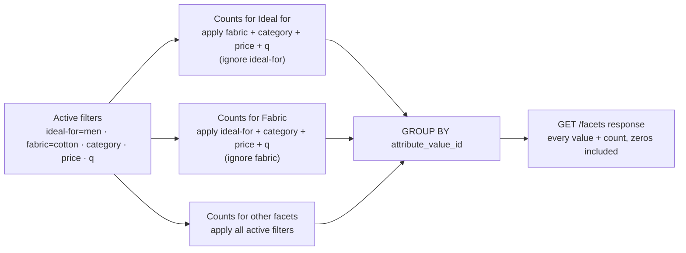
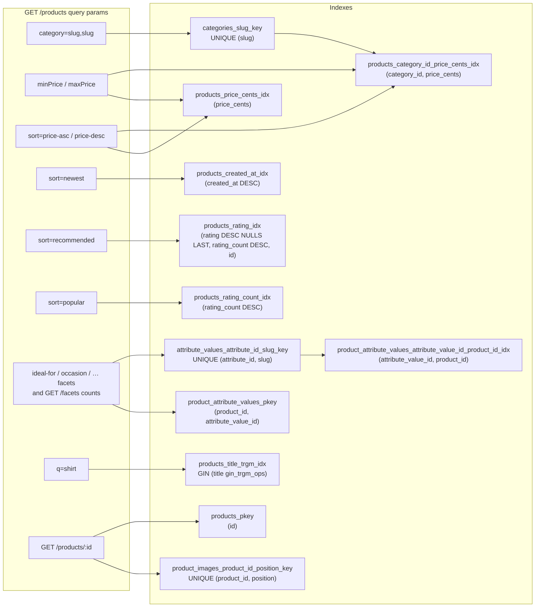
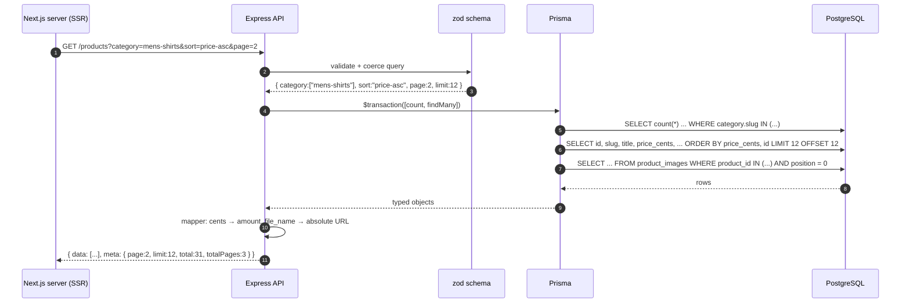
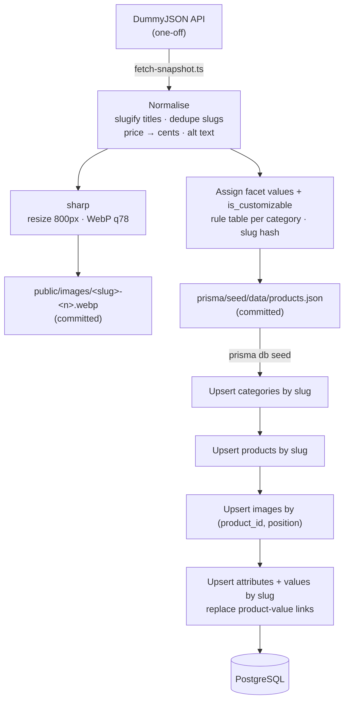
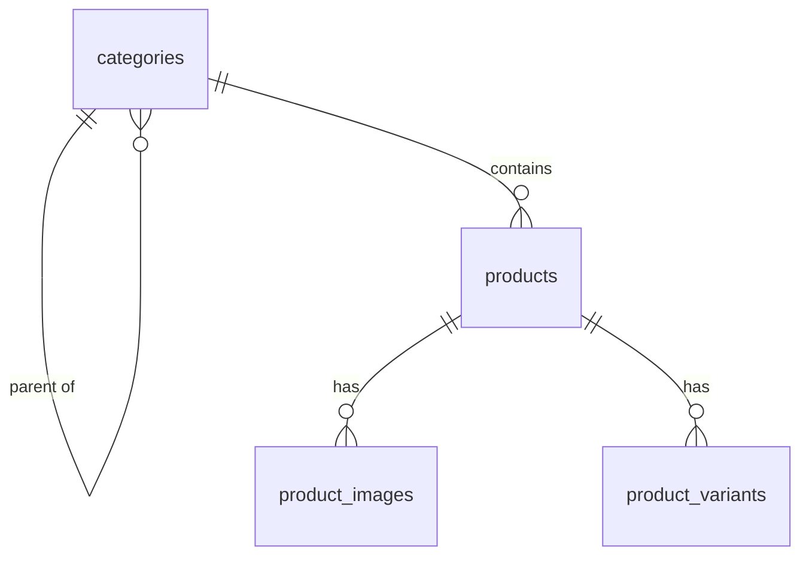

# Database Model Design — Appscrip PLP

PostgreSQL (Neon) · Prisma ORM · Node.js + Express API

This document explains **what** the tables are, **why** each was shaped that way, and **which query each index serves**. It is the reference for the schema in `backend/prisma/schema.prisma` and for the follow-up discussion.

---

## 1. Design principles

| Principle | Decision | Why |
|-----------|----------|-----|
| Normalise what is reused or queried | Separate `categories`, `product_images` and facet tables | Categories and facets are listed, filtered and counted; images need their own alt text, size and order |
| Money is never a float | `price_cents INTEGER` + `currency CHAR(3)` | `0.1 + 0.2 !== 0.3`; integer cents are exact |
| Every public entity has a slug | `slug UNIQUE` on products and categories | Human-readable URLs and filters (`?category=mens-shirts`), SEO image names |
| DB naming vs code naming | `snake_case` tables/columns, `camelCase` in Prisma via `@map` | Idiomatic SQL *and* idiomatic TypeScript |
| Indexes follow queries | Each index maps to a concrete API filter or sort (§6) | No speculative indexes; each one is explainable |
| The DB enforces invariants | FKs, UNIQUE and CHECK constraints | Bad data is rejected at the source, not just in API validation |
| Read-optimised | No soft deletes, no audit tables | The API is read-only; YAGNI |

---

## 2. Entity-relationship diagram



**Relationships**

| Relationship | Cardinality | On delete | Reasoning |
|--------------|-------------|-----------|-----------|
| categories → products | 1 : many | `RESTRICT` | Deleting a category that still has products is almost certainly a mistake, so it fails loudly |
| products → product_images | 1 : many | `CASCADE` | Images have no meaning without their product |
| attributes → attribute_values | 1 : many | `CASCADE` | A facet's options belong to it |
| products ↔ attribute_values | many : many via `product_attribute_values` | `CASCADE` both sides | A link row means nothing once either side is gone |

The seed guarantees every product has at least one image (position 0), but the DB doesn't enforce it. Postgres can't express "at least one child row" without triggers, which isn't worth it here. The API mapper handles a missing image defensively by falling back to a placeholder.

**Why each product has exactly one category (no many-to-many):** the source data and the Figma filter both treat category as single-valued. A `product_categories` join table would add a join to every listing query for no current benefit. §11 covers how this would evolve.

---

## 3. Table: `categories`

| Column | Type | Constraints | Notes |
|--------|------|-------------|-------|
| `id` | `SERIAL` | PK | Internal key; never exposed in URLs |
| `slug` | `VARCHAR(80)` | `NOT NULL UNIQUE` | Public identifier used in `?category=` |
| `name` | `VARCHAR(80)` | `NOT NULL` | Display label |
| `created_at` | `TIMESTAMPTZ` | `NOT NULL DEFAULT now()` | |

The `UNIQUE` on `slug` also creates the B-tree index used when filtering by category slug (§6).

`productCount` in `GET /categories` is **computed** with `_count`, not stored. At ~20 categories a `GROUP BY` costs microseconds, and a stored counter would need to be kept in sync.

---

## 4. Table: `products`

| Column | Type | Constraints | Notes |
|--------|------|-------------|-------|
| `id` | `SERIAL` | PK | Used by `GET /products/:id` and as the sort tie-breaker |
| `slug` | `VARCHAR(160)` | `NOT NULL UNIQUE` | From the title; duplicates get `-2`, `-3` |
| `title` | `VARCHAR(200)` | `NOT NULL` | Searched by `q` (trigram index) |
| `description` | `TEXT` | `NOT NULL` | Detail endpoint only; excluded from list `SELECT` |
| `brand` | `VARCHAR(100)` | nullable | Not every source product has one |
| `price_cents` | `INTEGER` | `NOT NULL CHECK (price_cents >= 0)` | `$19.99` → `1999` |
| `currency` | `CHAR(3)` | `NOT NULL DEFAULT 'USD'` | Fixed width, ISO 4217 |
| `rating` | `NUMERIC(2,1)` | nullable, `CHECK (rating BETWEEN 0 AND 5)` | Exact one-decimal value (4.3); NULL means unrated, not zero |
| `rating_count` | `INTEGER` | `NOT NULL DEFAULT 0 CHECK (>= 0)` | Secondary key for "recommended" |
| `stock` | `INTEGER` | `NOT NULL DEFAULT 0 CHECK (>= 0)` | Drives `schema.org` `availability` and the "Out of stock" overlay |
| `is_customizable` | `BOOLEAN` | `NOT NULL DEFAULT false` | The design's "Customizable" checkbox. A flag, not a facet, because it has one option. No index: a boolean over <100 rows; at scale, a partial index `WHERE is_customizable` |
| `category_id` | `INTEGER` | `NOT NULL FK → categories(id)` | |
| `created_at` | `TIMESTAMPTZ` | `NOT NULL DEFAULT now()` | Seed staggers values so "newest" is meaningful; also drives the "New product" badge (< 30 days, computed in the mapper) |
| `updated_at` | `TIMESTAMPTZ` | `NOT NULL` | Maintained by Prisma `@updatedAt` |

**Decisions worth defending:**
- **`price_cents` over `NUMERIC(10,2)`.** Both are exact. Integer cents are simpler to compare, index and send across JSON without string-decimal handling, and the conversion lives in one place (the mapper).
- **Nullable `rating`.** "No ratings yet" is different from "rated 0". Sorting puts NULLs last (§6).
- **No `is_active` / `deleted_at`.** Nothing deletes or hides products in this scope.
- **`TIMESTAMPTZ` everywhere.** It stores UTC unambiguously, which is the standard Postgres advice.

---

## 5. Table: `product_images`

| Column | Type | Constraints | Notes |
|--------|------|-------------|-------|
| `id` | `SERIAL` | PK | |
| `product_id` | `INTEGER` | `NOT NULL FK → products(id) ON DELETE CASCADE` | |
| `file_name` | `VARCHAR(200)` | `NOT NULL` | `mens-cotton-slim-fit-tshirt-1.webp`, the SEO requirement |
| `alt` | `VARCHAR(250)` | `NOT NULL` | Meaningful alt text, generated at snapshot time |
| `width`, `height` | `INTEGER` | `NOT NULL CHECK (> 0)` | Lets `next/image` reserve space, so CLS is 0 |
| `position` | `INTEGER` | `NOT NULL DEFAULT 0 CHECK (>= 0)` | 0 = primary/card image |
| | | `UNIQUE (product_id, position)` | One image per slot; also the upsert key for the seed |

**Why a table instead of a `text[]` or `jsonb` column on `products`:** each image carries its own alt text, dimensions and order. A table keeps that typed and constrained, and lets the list query fetch *only* the primary image.

**Why store `file_name`, not a full URL:** the host changes between local, staging and production. The mapper builds `PUBLIC_BASE_URL + '/images/' + file_name` at response time, so moving to a CDN later is a config change, not a data migration.

---

## 5a. Facet tables: `attributes`, `attribute_values`, `product_attribute_values`

The Figma's filter panel has eight multi-select facets, each option with a count ("Men (65)"). These tables model them.

| Table | Columns | Constraints |
|-------|---------|-------------|
| `attributes` | `id`, `slug VARCHAR(40)`, `name VARCHAR(60)`, `position INT` | `UNIQUE (slug)`. The slug is also the URL param name (`?ideal-for=`) |
| `attribute_values` | `id`, `attribute_id FK`, `slug VARCHAR(60)`, `name VARCHAR(60)`, `position INT` | `UNIQUE (attribute_id, slug)`. "cotton" can exist under both Fabric and Raw materials |
| `product_attribute_values` | `product_id FK`, `attribute_value_id FK` | `PRIMARY KEY (product_id, attribute_value_id)`; index `(attribute_value_id, product_id)` |

A product can have several values of one facet (Occasion: Casual *and* Party), which is why this is a join table rather than one column per facet.

**Why this shape instead of the alternatives:**

| Option | Verdict |
|--------|---------|
| One column per facet on `products` (`fabric TEXT[]`, …) | Rejected. 8+ columns, a migration for every new facet, and counts need a different query per column |
| `jsonb attributes` on `products` + GIN index | Quick to build, but values aren't constrained (typos become new options), and counts need `jsonb_each` / `jsonb_array_elements` unnesting |
| **Normalised attribute / value / join** | **Chosen.** Options are typed rows guarded by FKs; counts are a plain `GROUP BY`; a new facet is new rows, not a migration |

**Values seeded (straight from the Figma's option lists):**

| Facet (`slug`) | Values |
|----------------|--------|
| Ideal for (`ideal-for`) | Men, Women, Baby & Kids |
| Occasion (`occasion`) | Rainy Season, Casual, Wedding, Party, Regular |
| Work (`work`) | French Knot, Zardosi, Fancy, Embroidery |
| Fabric (`fabric`) | Muslin, Satin Blend, Satin, Tericoat, Linen, Raw Silk, Cotton, Silk, Cotton Silk |
| Segment (`segment`) | Silver, Ethnic, Contemporary |
| Suitable for (`suitable-for`) | Formal Wear, Western Wear, Casual Wear |
| Raw materials (`raw-materials`) | Wool, Leather, Cotton, Cellulosic Fibers |
| Pattern (`pattern`) | Windowpane, Pinstripes, Solid, Chalk Stripes, Slim Fit, Tartan |

The Figma file also contains hidden layers for Jacket Material, Sleeve Length and Sleeve. They aren't visible in any frame, so they're left out. Adding them later is just seed rows, which demonstrates the point of this design.

**Filter semantics: OR within a facet, AND across facets.** `?ideal-for=men,women&fabric=cotton` means *(Men OR Women) AND Cotton*:

```sql
WHERE EXISTS (SELECT 1 FROM product_attribute_values pav
              JOIN attribute_values av ON av.id = pav.attribute_value_id
              JOIN attributes a        ON a.id  = av.attribute_id
              WHERE pav.product_id = p.id AND a.slug = 'ideal-for' AND av.slug IN ('men', 'women'))
  AND EXISTS (... a.slug = 'fabric' AND av.slug IN ('cotton'))
```

In Prisma this is an `AND` array of `{ attributeValues: { some: { attributeValue: { slug: { in }, attribute: { slug } } } } }` clauses.

**Counts are disjunctive.** Each facet's counts apply every active filter *except that facet's own selection*. Otherwise ticking "Men" would show "Women (0)", and the user could never widen the selection.



```sql
-- counts for one facet (Prisma groupBy generates the equivalent)
SELECT pav.attribute_value_id, count(*)
FROM product_attribute_values pav
JOIN attribute_values av ON av.id = pav.attribute_value_id
JOIN products p          ON p.id  = pav.product_id
WHERE av.attribute_id = $facet_id
  AND /* every product filter except this facet */
GROUP BY pav.attribute_value_id;
```

**Honesty note for the README:** the source data has no such attributes, so values are assigned at seed time by a documented rule table (which values fit which category) plus a hash of the product slug. The data is synthetic but deterministic, and every option comes from the design.

---

## 6. Indexes — mapped to queries

Postgres does **not** auto-index foreign key columns. Every index below is deliberate.



| Index | Columns | Serves | Notes |
|-------|---------|--------|-------|
| `categories_slug_key` | `UNIQUE (slug)` | Resolving `?category=` slugs | Free from the UNIQUE constraint |
| `products_slug_key` | `UNIQUE (slug)` | Slug uniqueness; future slug lookups | Free from the UNIQUE constraint |
| `products_category_id_price_cents_idx` | `(category_id, price_cents)` | Category filter; category + price range; category + price sort | **Leftmost-prefix rule:** also serves `category_id` alone, so no separate FK index is needed |
| `products_price_cents_idx` | `(price_cents)` | Price range or price sort without a category | |
| `products_created_at_idx` | `(created_at DESC)` | `sort=newest` | |
| `products_rating_idx` | `(rating DESC NULLS LAST, rating_count DESC, id)` | `sort=recommended` | Matches the ORDER BY exactly, so Postgres can read the index in order and stop after `LIMIT` |
| `products_title_trgm_idx` | `GIN (title gin_trgm_ops)` | `q` search (`ILIKE '%shirt%'`) | Needs `pg_trgm`. B-trees can't serve leading-wildcard `LIKE` |
| `product_images_product_id_position_key` | `UNIQUE (product_id, position)` | Fetching a product's images; the "primary image" lookup | Leftmost prefix covers the FK |
| `products_rating_count_idx` | `(rating_count DESC)` | `sort=popular` | |
| `attribute_values_attribute_id_slug_key` | `UNIQUE (attribute_id, slug)` | Resolving `?fabric=cotton` to value ids | Free from the UNIQUE constraint |
| `product_attribute_values_attribute_value_id_product_id_idx` | `(attribute_value_id, product_id)` | Facet filters ("products having value X") and facet counts (`GROUP BY attribute_value_id`) | Covering: answers both without touching the heap |
| `product_attribute_values_pkey` | `(product_id, attribute_value_id)` | The `EXISTS` check per product; prevents duplicate links | The reverse direction of the index above |

**Honest caveats** (good to state in the README):
- At under 100 rows the whole table fits in a few pages, so the planner will often prefer a sequential scan, which is correct at this size. The indexes are designed for growth, and `EXPLAIN ANALYZE` can demonstrate them after seeding a few thousand extra rows.
- Trigram search needs at least 3 characters to use the index effectively. Shorter queries fall back to a scan, which is acceptable here.
- `category IN (...)` combined with `sort=newest` can't use a single index for both. At this scale that is irrelevant; at scale, a `(category_id, created_at DESC)` index would be added once real query stats justified it.
- The `rating` index uses `NULLS LAST` and two extra columns, which Prisma's schema syntax can't express. It is created in the raw SQL migration (§8).

---

## 7. How a request uses the model



Roughly the SQL Prisma generates for the main list query (simplified):

```sql
SELECT p.id, p.slug, p.title, p.price_cents, p.currency, p.rating, p.rating_count, p.category_id
FROM products p
WHERE p.category_id IN (SELECT id FROM categories WHERE slug = ANY($1))
  AND p.price_cents BETWEEN $2 AND $3
ORDER BY p.price_cents ASC, p.id ASC
LIMIT 12 OFFSET 12;
```

**Why `id` is always the last sort key:** many products share a price or rating. Without a unique tie-breaker, Postgres may return ties in a different order on each query, so an item could appear on both page 1 and page 2, or on neither.

**Why offset pagination:** it's simple, works with numbered page links (crawlable, SEO-friendly), and is fast at this size. Cursor (keyset) pagination is the scaling path, but it doesn't support jumping to page N, which the design's numbered pagination needs.

---

## 8. Migrations

| Migration | Generated by | Contents |
|-----------|--------------|----------|
| `0001_init` | `prisma migrate dev` | Tables, PKs, FKs, UNIQUEs, the B-tree indexes Prisma can express |
| `0002_search_checks_rating_idx` | Hand-written SQL (`prisma migrate dev --create-only`, then edited) | `pg_trgm` + GIN index, CHECK constraints, the `NULLS LAST` rating index |

```sql
-- 0002_search_checks_rating_idx/migration.sql
CREATE EXTENSION IF NOT EXISTS pg_trgm;
CREATE INDEX products_title_trgm_idx ON products USING GIN (title gin_trgm_ops);

CREATE INDEX products_rating_idx
  ON products (rating DESC NULLS LAST, rating_count DESC, id);

ALTER TABLE products
  ADD CONSTRAINT products_price_cents_check  CHECK (price_cents >= 0),
  ADD CONSTRAINT products_rating_check       CHECK (rating BETWEEN 0 AND 5),
  ADD CONSTRAINT products_rating_count_check CHECK (rating_count >= 0),
  ADD CONSTRAINT products_stock_check        CHECK (stock >= 0);

ALTER TABLE product_images
  ADD CONSTRAINT product_images_position_check   CHECK (position >= 0),
  ADD CONSTRAINT product_images_dimensions_check CHECK (width > 0 AND height > 0);
```

Prisma doesn't model CHECK constraints or custom index expressions, so they live in SQL. Prisma ignores objects it doesn't know about, so later `migrate dev` runs won't try to drop them. That's worth one sentence in the README, since it shows you know where the ORM's abstraction ends.

Production applies these with `prisma migrate deploy` (no drift detection, no prompts).

---

## 9. Seed data flow



| Property | How it's achieved |
|----------|-------------------|
| Reproducible | Seed reads a committed snapshot, never the live third-party API |
| Idempotent | Upserts on natural keys (`slug`, `(product_id, position)`); safe to re-run |
| Atomic | Runs inside one transaction; a failure leaves the DB unchanged |
| Realistic "newest" | `created_at` staggered across the past ~90 days, deterministically (from index, not random) |
| Honest synthetic facets | Values come only from the Figma's option lists, assigned by a documented rule table; the README states they are synthetic |

**Approximate volumes:** ~10 categories, ~60–80 products (filtered to the design's storefront), ~200 images, 8 facets with 37 values, roughly 5 MB of WebP in the repo.

---

## 10. Sample rows

**categories**

| id | slug | name |
|----|------|------|
| 1 | `mens-shirts` | Men's Shirts |
| 2 | `tops` | Tops |

**products**

| id | slug | title | price_cents | currency | rating | rating_count | stock | category_id |
|----|------|-------|-------------|----------|--------|--------------|-------|-------------|
| 12 | `mens-cotton-slim-fit-tshirt` | Men's Cotton Slim Fit T-Shirt | 1999 | USD | 4.3 | 120 | 34 | 1 |

**product_images**

| id | product_id | file_name | alt | width | height | position |
|----|------------|-----------|-----|-------|--------|----------|
| 40 | 12 | `mens-cotton-slim-fit-tshirt-1.webp` | Men's Cotton Slim Fit T-Shirt, Men's Shirts | 800 | 800 | 0 |
| 41 | 12 | `mens-cotton-slim-fit-tshirt-2.webp` | Men's Cotton Slim Fit T-Shirt, Men's Shirts, side view | 800 | 800 | 1 |

**attributes** / **attribute_values**

| attributes.id | attributes.slug | attribute_values.id | attribute_values.slug | attribute_values.name |
|---------------|-----------------|---------------------|-----------------------|-----------------------|
| 1 | `ideal-for` | 1 | `men` | Men |
| 1 | `ideal-for` | 2 | `women` | Women |
| 4 | `fabric` | 17 | `cotton` | Cotton |

**product_attribute_values**

| product_id | attribute_value_id |
|------------|--------------------|
| 12 | 1 |
| 12 | 17 |

---

## 11. How the model would evolve (README "with more time")



| Need | Change | Why not now |
|------|--------|-------------|
| Real facet data | Source attributes from a real catalogue or an admin UI instead of seed rules | No real source exists for this task |
| Category tree (Men → Shirts) | Self-referencing `parent_id` on `categories` | Flat categories match the source data |
| Sizes and colours | `product_variants` with its own SKU, price and stock | No variants in scope |
| Multi-currency | `prices` table per currency, or convert at the edge | Single currency in scope |
| Large catalogues | Keyset pagination; Postgres full-text search or a search engine | Offset + trigram is right at this size |
| Facet counts at scale | Materialised counts, or a search engine with native faceting | 8 small `GROUP BY`s over <100 products are instant |

