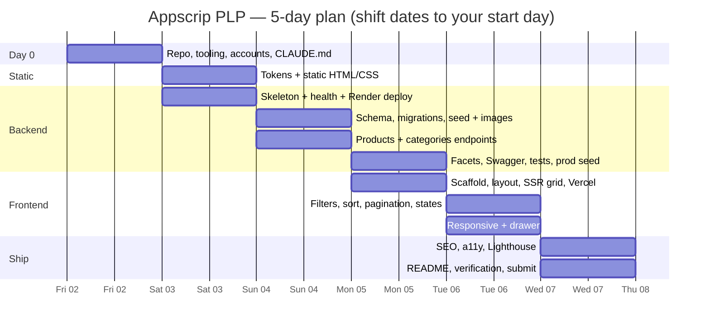
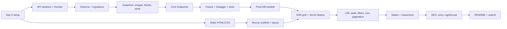

# Development Plan — Appscrip PLP

How the work in `product.md`, `frontend-plan.md`, `backend-plan.md` and `dbmodal.md` gets built: in what order, in what size of steps, with what checks, and what gets cut if time runs short.

**Assumed budget:** 5 working days plus a short Day 0. The deadline is still unconfirmed, so ask the recruiter. §8 says what to cut for a shorter deadline.

---

## 1. Guiding rules

| Rule | Why |
|------|-----|
| **Deploy a skeleton on Day 1, not Day 5** | Render cold starts, cross-region latency and Neon connection strings are the most likely surprises. Find them while there's time to react |
| **Backend before the functional frontend** | SSR pages are built against the real API from the first line, with no mock layer to throw away |
| **Static HTML/CSS first** | Required by the brief, and it doubles as the design spike: tokens and markup carry into Next.js |
| **You commit, not the AI** | AI tools never run `git commit`, `git push` or anything that rewrites history. They stop at a diff; you review it, stage it and commit it with your own message. The history they read is yours |
| **Small commits, conventional messages** | They read the commit history. Aim for 40–70 commits, each one buildable |
| **Every file is properly commented** | Evaluators read the code, and you must be able to explain every line. Follow the comment standard in §2 |
| **Every task has a "done when"** | A task isn't done until its check passes. No "mostly works" |
| **Log AI corrections as they happen** | The README's AI section needs a *real* rejected-output example; write it down the moment it happens |
| **Graded items before polish** | Weights: structure 20, backend 20, frontend 15, SSR/perf 15, SEO 10, responsive 10, docs 5, AI 5 |

---

## 2. Repository layout and conventions

```
Appscrip-task-PrashukJain/
├── static/                 # Phase 1: plain HTML/CSS
├── frontend/               # Next.js (App Router, TS)
├── backend/                # Express + Prisma
├── docs/                   # assignment.pdf (original brief), INSTRUCTIONS.md, progress.md, product.md, frontend-plan.md, backend-plan.md, dbmodal.md, development-plan.md, ai-log.md
├── docker-compose.yml      # local Postgres 16 only
├── .github/workflows/ci.yml
├── .nvmrc                  # Node 22
├── .editorconfig
├── .gitignore              # node_modules, .env, .next, dist
├── CLAUDE.md               # root rules for Claude Code (kept in repo, per brief)
├── frontend/CLAUDE.md      # frontend-specific rules (loaded when working in frontend/)
├── backend/CLAUDE.md       # backend-specific rules (loaded when working in backend/)
├── .claude/settings.json   # permissions: git commits/pushes blocked, .env unreadable
├── .claude/commands/       # /task and /review slash commands
└── README.md
```

**Commits** use [Conventional Commits](https://www.conventionalcommits.org) with a scope:

```
feat(api): add GET /products with category and price filters
feat(plp): render product grid server-side from API
fix(api): keep pagination stable with id tie-breaker
chore(db): add trigram and rating indexes migration
docs(readme): document canonical URL policy
```

Scopes: `static`, `api`, `db`, `seed`, `plp`, `layout`, `seo`, `a11y`, `ci`, `deploy`, `docs`.

**Branching:** work on `main` in small commits. That's fine for a solo take-home and keeps the history linear and readable. Tag `v1.0.0` at submission.

**Package manager:** npm, with a committed `package-lock.json` per app.

**Committing workflow (manual, every time)**
1. The AI tool makes changes in the working tree only. No `git add`, `git commit`, `git push`, `git rebase` or `git reset`. `CLAUDE.md` states this explicitly.
2. You review with `git diff`, and run the task's lint, typecheck and "done when" check.
3. You stage deliberately (`git add -p` for mixed changes) and check `git diff --staged`.
4. You commit with your own Conventional Commit message. The messages in §4 are suggestions.
5. You push when the day's work builds.

**Code comment standard**

Comments explain *why*; the code explains *what*.

| Where | What to write |
|-------|---------------|
| Top of every source file | One or two lines on the module's responsibility and boundaries, e.g. `// Products service: listing queries (filters, sort, pagination). No Express imports.` |
| Every exported function, component, type and zod schema | A TSDoc `/** … */` block: purpose, important params, return value, and errors it throws or status codes it maps to |
| Non-obvious decisions | A short "why" comment at the exact line: the `id` tie-breaker, `<Suspense key>`, `res.locals.validated` (Express 5's read-only `req.query`), price in cents, disjunctive facet counts, the cookie-based filter toggle |
| Prisma schema | `///` doc comments on models and non-obvious fields (Prisma keeps these in the generated client types) |
| SQL migrations | A comment above each statement naming the query it serves or the invariant it enforces |
| CSS | Section headers (`/* ── Product card ── */`) and a note on any magic number traced back to the Figma |
| Seed and scripts | A header describing inputs, outputs and how to re-run safely |

Don't:
- Narrate obvious code (`// loop over products`).
- Commit commented-out code.
- Leave a bare `TODO`. Use `TODO(prashuk): <what and why>` only for deliberate gaps, and list them under the README's known limitations.
- Let a comment go stale. An outdated comment is a bug; update it in the same commit as the code.

Example:

```ts
/**
 * Lists products for the PLP.
 * @param query Validated listing query (see `listProductsQuery`).
 * @returns One page of product summaries plus pagination meta.
 */
export async function listProducts(query: ListProductsQuery) {
  const where = buildWhere(query);
  const [total, rows] = await prisma.$transaction([
    prisma.product.count({ where }),
    prisma.product.findMany({
      where,
      // `id` is always the last sort key: products often share a price or rating,
      // and without a unique tie-breaker an item could appear on two pages or none.
      orderBy: SORT_MAP[query.sort],
      skip: (query.page - 1) * query.limit,
      take: query.limit,
      select: SUMMARY_SELECT,
    }),
  ]);
  return { data: rows.map(toSummary), meta: buildMeta(query, total) };
}
```

---

## 3. Timeline



| Day | Focus | End-of-day state |
|-----|-------|------------------|
| 0 | Setup | Repo public, tooling in place, Neon/Render/Vercel accounts ready |
| 1 | Static + backend skeleton | `/static` matches Figma; `/health` live on Render |
| 2 | Data + core API | DB seeded locally; `/products`, `/products/:id`, `/categories` work with validation |
| 3 | API complete + frontend live | `/facets`, `/docs`, tests done; production DB seeded; SSR grid live on Vercel |
| 4 | Frontend functional | All filters, sort, search, pagination, states and responsive layouts work |
| 5 | Polish + ship | SEO, a11y, Lighthouse, README done; links verified; submitted |

---

## 4. Task breakdown

Each task lists its IDs, what to build, its done-when check, and suggested commit message(s). You make every commit yourself (§2). Plan references point to the detailed design.

### Day 0 — Setup (~2–3 h)

| ID | Task | Done when |
|----|------|-----------|
| S-01 | Create public repo `Appscrip-task-PrashukJain`; add `.gitignore`, `.editorconfig`, `.nvmrc`, `README.md` stub | Repo is public, first commit pushed |
| S-02 | Add `docs/` with all five plan docs; create `docs/ai-log.md` (date · tool · task · what was wrong · what you did) | Docs committed |
| S-03 | Add the Claude Code setup: root `CLAUDE.md`, `frontend/CLAUDE.md`, `backend/CLAUDE.md`, `.claude/settings.json`, `.claude/commands/task.md` and `review.md`. Save the brief as `docs/assignment.pdf`. In Claude Code, run `/permissions` to confirm git commit/push are denied | Claude Code loads the rules on start; `git commit` attempted by Claude is blocked |
| S-04 | `docker-compose.yml` with Postgres 16 | `docker compose up -d` then `psql` connects |
| S-05 | Create Neon project in AWS us-east-1 (pooled + direct URLs), Render account (region: Virginia), Vercel account; cron-job.org account for keep-warm | All four dashboards accessible; no secrets in the repo |

Suggested commit (you commit manually): `chore: initialise monorepo with docs, tooling and CLAUDE.md`

### Day 1 — Static HTML/CSS + backend skeleton

**Static** (see `frontend-plan.md` §2)

| ID | Task | Done when |
|----|------|-----------|
| ST-01 | Extract tokens from Figma: colours, font families and sizes, spacing, breakpoints. Keep Figma calls few, since the free plan has a low limit | `static/tokens.css` committed |
| ST-02 | Header: announcement bar, logo row, icons, nav; mobile hamburger variant | Matches the Figma at 1440 and 375 |
| ST-03 | Heading block, toolbar, filter sidebar (accordions with `<details>`), sort menu | Matches the "With Filter" and "Expanded" frames |
| ST-04 | Product grid + card (badge, out-of-stock overlay, heart, price slot); 3- and 4-column states | Matches the "With Filter" and "Hidden Filter" frames |
| ST-05 | Footer (desktop columns, mobile accordions) | Matches desktop and mobile frames |
| ST-06 | Responsive pass at 320 / 375 / 768 / 1024 / 1440 | No horizontal scroll at any width |

Suggested commits (you commit manually): one per ST task, e.g. `feat(static): add product grid and card`.

**Backend skeleton** (see `backend-plan.md` §2, §6, §8)

| ID | Task | Done when |
|----|------|-----------|
| B-01 | `backend/` TS project: Express 5, `tsx`, `tsc`, ESLint, Prettier; `app.ts` / `server.ts` split | `npm run dev` serves on :3001 |
| B-02 | `config/env.ts` (zod), `lib/http-error.ts`, `not-found` + `error-handler` middleware, helmet, cors, request logger | Unknown route returns 404 in the shared error shape; bad env exits with a clear message |
| B-03 | Prisma init + `lib/prisma.ts`; `GET /health` runs `SELECT 1` | `/health` returns `{ status: "ok" }` locally against Docker Postgres |
| B-04 | **Deploy to Render** with Neon; health check path `/health`; cron ping every 10 min | Public `/health` URL works; first Render deploy is green |

Suggested commits (you commit manually): `chore(api): scaffold Express app with env validation`, `feat(api): add error handling and health endpoint`, `chore(deploy): deploy API skeleton to Render`.

### Day 2 — Database, seed, core API

**Database** (see `dbmodal.md`)

| ID | Task | Done when |
|----|------|-----------|
| D-01 | `schema.prisma`: categories, products (incl. `is_customizable`), product_images, attributes, attribute_values, product_attribute_values | `prisma migrate dev` creates `0001_init` |
| D-02 | Hand-written `0002`: `pg_trgm` + GIN index, rating `NULLS LAST` index, CHECK constraints | `\d products` in psql shows all indexes and constraints |

**Seed** (see `backend-plan.md` §7, `dbmodal.md` §9)

| ID | Task | Done when |
|----|------|-----------|
| SD-01 | `fetch-snapshot.ts`: DummyJSON → storefront categories only → slugs, cents, alt text | `products.json` written with ~60–80 products |
| SD-02 | Image pipeline: download, `sharp` → 800px WebP, `<slug>-<n>.webp` | `public/images/` populated, ~5 MB, names are human-readable |
| SD-03 | Facet rule table + slug hash → facet values and `isCustomizable` in the snapshot | Every product has at least one value per facet; re-running gives identical output |
| SD-04 | `seed.ts`: transactional upserts on natural keys | Running it twice leaves identical row counts |

**Core API** (see `backend-plan.md` §4–§6)

| ID | Task | Done when |
|----|------|-----------|
| A-01 | `validate()` middleware → `res.locals.validated`; typed helper | A ZodError produces a 400 with `details[]` |
| A-02 | `GET /categories` with `productCount` | Returns sorted categories with counts |
| A-03 | `GET /products`: zod query schema (strict), `buildWhere` (category, price, customizable, facets, q), `SORT_MAP` with id tie-breaker, `$transaction([count, findMany])`, mapper | Every filter and sort works by `curl`; page 1 and page 2 never overlap |
| A-04 | `GET /products/:id` with all images | Bad id → 400, missing → 404, both in the shared shape |
| A-05 | `express.static` for `/images` with an immutable cache; `cache-control` middleware on GET routes | Image response has `Content-Type: image/webp` and a 1-year cache header |

Suggested commits (you commit manually): one per D/SD/A task, e.g. `feat(seed): convert images to SEO-named WebP`, `feat(api): add product listing with filters, sort and pagination`.

### Day 3 — API complete, frontend live

**Backend finish**

| ID | Task | Done when |
|----|------|-----------|
| A-06 | `GET /facets` with disjunctive counts (one `groupBy` per facet, in parallel) | Selecting `ideal-for=men` still shows a non-zero Women count |
| A-07 | OpenAPI via zod-to-openapi + swagger-ui at `/docs`, `/openapi.json` | Every endpoint and param is documented with examples; "Try it out" works |
| A-08 | e2e tests (`node:test` + supertest): list, filters, sorts, facets, validation and 404 errors | `npm test` passes locally |
| A-09 | Production: `migrate deploy` as Render pre-deploy, run the seed against Neon, set `CORS_ORIGINS` and `PUBLIC_BASE_URL` | Live `/products`, `/facets` and `/docs` return seeded data |

**Frontend scaffold** (see `frontend-plan.md` §3–§5)

| ID | Task | Done when |
|----|------|-----------|
| F-01 | `create-next-app` (TS, App Router, no Tailwind); port `tokens.css` to `globals.css`; `next/font` | Dev server runs with design fonts and colours |
| F-02 | Layout: AnnouncementBar, Header, MobileNav, Footer, NewsletterForm; skip link | Static parts match the `/static` version |
| F-03 | `types/api.ts`, `lib/api.ts` (`server-only`, 8s timeout, `ApiError`) | A typed `getProducts()` call works from a server component |
| F-04 | `page.tsx` renders the unfiltered grid from the live API; ProductCard with `next/image` | View-source shows `<article>` product cards |
| F-05 | **Deploy to Vercel** (Root Directory `frontend`, function region `iad1`); set `API_URL`, `SITE_URL`; `images.remotePatterns` | `curl -s $SITE \| grep -c "<article"` is greater than 0 on the deployed URL |

Suggested commits (you commit manually): `feat(api): add facet counts endpoint`, `docs(api): generate OpenAPI and serve Swagger UI`, `test(api): cover listing, facets and validation errors`, `feat(plp): server-render product grid from API`, `chore(deploy): deploy frontend to Vercel`.

### Day 4 — Frontend functional

| ID | Task | Done when |
|----|------|-----------|
| F-06 | `lib/search-params.ts`: parse, normalise, serialise, `withChange` (resets page) | Messy URLs normalise to one canonical form |
| F-07 | Pagination (`<Link>`s, `aria-current`, out-of-range redirect) | Paging works with JS disabled |
| F-08 | SortMenu (`<details>` + links, checkmark, Esc/outside-click enhancement) | Sorting works with and without JS; labels match Figma |
| F-09 | FilterForm as a GET form: Customizable, Category, Price, 8 FacetGroups with counts from `/facets`, "Unselect all", "Clear all"; `router.push` in `useTransition` | Each filter updates the URL and the grid without a full reload; counts update |
| F-10 | Header search → `q` | `?q=bag` filters the grid |
| F-11 | FilterToggle with a cookie; 3- vs 4-column grid rendered by the server | Toggle persists across reloads with no layout flash |
| F-12 | States: `loading.tsx`, `<Suspense key>` skeleton, `error.tsx` with retry, EmptyState, `aria-busy`, `aria-live` count | Each state is reproducible: throttle the network, stop the API, use impossible filters |
| F-13 | WishlistButton (browser storage, `aria-pressed`) | The heart persists per product after reload |
| F-14 | Mobile: FILTER/RECOMMENDED split bar, `<dialog>` filter drawer, footer accordions; tablet layout | No horizontal scroll at 320–1440; drawer is keyboard-usable and Esc closes it |

Suggested commits (you commit manually): one per task, e.g. `feat(plp): add URL-driven facet filters with counts`, `feat(plp): add skeleton, empty and error states`.

### Day 5 — SEO, quality, ship

| ID | Task | Done when |
|----|------|-----------|
| Q-01 | `generateMetadata` (state-aware title and description), canonical policy, `noindex` for `q`, OG/Twitter tags, `og-image.png` | The rendered `<head>` is correct for 3 sample URLs |
| Q-02 | JSON-LD: `ItemList` → `Product` + `Offer`, and `BreadcrumbList` | Google Rich Results Test reports no errors |
| Q-03 | `robots.ts`, `sitemap.ts` (incl. category URLs) | `/robots.txt` and `/sitemap.xml` are served |
| Q-04 | Heading audit (one H1, H2 sections, H3 cards); semantic landmarks | The headings outline (e.g. a browser extension) is clean |
| Q-05 | A11y pass: keyboard-only walk-through, focus-visible, labels, contrast check | All flows complete without a mouse; contrast is AA |
| Q-06 | Lighthouse (mobile + desktop) on the deployed URL; fix the top issues | Scores recorded for the README |
| Q-07 | CI: GitHub Actions running lint + typecheck + backend tests on push | Green check on `main` |
| Q-08 | README: all 9 sections (see §7) | A fresh clone runs locally by following only the README |
| Q-09 | Final verification (§6), tag `v1.0.0`, send the 3 links | Submitted |
| Q-10 | *Stretch:* PDP `/products/[idSlug]` with `Product` and `BreadcrumbList` JSON-LD | Only if Q-01 to Q-09 are done |

---

## 5. Dependencies



The critical path runs through the seed and the core API. If Day 2 slips, the frontend can start against local Docker Postgres while production deploy waits, but don't skip F-05 (the production SSR check on Vercel).

---

## 6. Quality gates

**Per task (before each commit)**
- You've read the full diff yourself (`git diff --staged`), including anything AI generated.
- New and changed code follows the comment standard (§2).
- `npm run lint` and `npm run typecheck` pass in the app you touched.
- The task's "done when" check has actually been run.
- No secrets, `.env` files or stray console logs are staged.
- If AI produced something you corrected, it's logged in `docs/ai-log.md`.

**Per day (end of day)**
- `main` builds and deploys.
- The live links still work.
- Tomorrow's first task is written down.

**Before submission**

| Check | How |
|-------|-----|
| SSR is real in production | `curl -s $SITE \| grep "<article"` shows product markup |
| Filters are shareable | Paste a filtered URL into a private window → same results |
| No full reloads | Network tab shows no document request on filter or sort change |
| API validation | `/products?limit=999`, `/products?sort=x`, `/products?foo=1`, `/products/abc` → 400 with `details` |
| 404s | `/products/999999` → 404 in the shared shape |
| Cold start | Wait an hour, then open the site; it loads (keep-warm works) or shows the error state with retry |
| Responsive | 320, 375, 768, 1024, 1440: no horizontal scroll, layouts match Figma |
| SEO | One H1; JSON-LD valid; canonical, OG and meta present; image filenames are slugs; alt text is meaningful |
| Images | WebP, correctly sized, first row eager and the rest lazy |
| Local setup | Fresh clone → follow the README → app runs |
| Repo | Name correct; `CLAUDE.md` present; history is readable; no `.env` in history; every commit made by you |
| Comments | Every source file has a header; exports have TSDoc; no commented-out code; remaining `TODO(prashuk)`s are listed in the README |

---

## 7. README plan

Draft it throughout the week, not all on the last day. Each section maps to the brief's list:

| # | Section | Source material |
|---|---------|-----------------|
| 1 | Live URLs (frontend, API, `/docs`) | Deploy tasks B-04, A-09, F-05 |
| 2 | Tech stack and why | `backend-plan.md` §1, `frontend-plan.md` §1, "Why Express" note |
| 3 | Local setup | Docker Postgres → `migrate dev` → `db seed` → `dev` (both apps) |
| 4 | Architecture and folders | Folder trees and layering rules from the plans; one Mermaid diagram |
| 5 | API endpoints | Table + link to `/docs` |
| 6 | SSR and SEO decisions | Server-component grid, Suspense key, canonical policy, JSON-LD, image naming |
| 7 | Dependencies and why | One line per package, both apps |
| 8 | AI usage | Tools used, where they helped, the real rejected-output example from `ai-log.md`, and a pointer to `CLAUDE.md` |
| 9 | Known limitations / with more time | Design deviations (price shown, Category and Price filters added, pagination added), synthetic facet data, no auth/cart, offset pagination, rate limiting, PDP if skipped |

---

## 8. Risks and cut list

**Risks**

| Risk | Likelihood | Impact | Mitigation |
|------|------------|--------|------------|
| Slow SSR from cross-region hops (Vercel → Render → Neon) | Medium | Medium | Put all three in US East (Vercel `iad1`, Render Virginia, Neon us-east-1); check response times on Day 3 |
| Render cold start fails the SSR fetch | High on free tier | High | Keep-warm cron; 8s timeout; error state with retry |
| zod / zod-to-openapi version mismatch | Medium | Low | Pin compatible versions on Day 3; worst case, hand-write `openapi.json` |
| Disjunctive facet counts take longer than planned | Medium | Medium | Ship plain (non-disjunctive) counts first, then refine |
| Figma free-plan call limit runs out | Medium | Low | Extract tokens in a few calls on Day 1; screenshots are already in hand |
| Pixel-matching eats the schedule | High | Medium | Timebox ST tasks; "close and consistent" beats pixel-perfect at 15% weight |
| Deadline shorter than 5 days | Unknown | High | Use the cut list below |

**Cut list.** If time is short, drop items in this order, from the top:

1. Q-10 PDP (stretch).
2. Q-07 CI workflow.
3. F-13 wishlist persistence (keep the static heart).
4. F-11 cookie for the filter toggle (keep the toggle; default to shown).
5. A-08 test breadth: keep validation and 404 tests, drop the sort and facet cases.
6. Disjunctive counts: fall back to plain counts and note it in limitations.

Never cut: SSR, URL-driven filters/sort/pagination, validation and error shape, migrations + indexes + seed, SEO basics, responsive, working live links, README, AI section.

**3-day compression** (if the deadline turns out to be 3 days):
- Day 1 = static + backend skeleton + schema + seed.
- Day 2 = all endpoints + frontend SSR + filters.
- Day 3 = states, responsive, SEO, README, submit.
- Apply cuts 1–5 up front.
